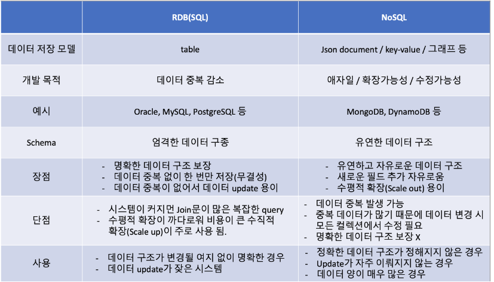

# 6월 21일 정리

## **반엔트로피 프로토콜 알고리즘이 영구적인지? - 오진서**

- 임시 알고리즘
    - 에러가 터지면 다른 임시 DB에 처리하고 복구된 애들이 다시 처리하도록
    - 가용성을 중시한 느낌
- 반 엔트로피 알고리즘
    - 일관성을 중시한 느낌

## 가용성과 일관성 어느걸 중요시 해야할까?

- 일관성
    - 커머스(주문 처리), 은행
- 가용성
    - dns, 캐시 시스템
    - 최신으로 운행되지 않더라도(과거 데이터) 운영하는게 중요한 부분

## 키-값 저장소 쓰는 이유?

- NoSQL
    - 예시: 사진을 다루는 서비스 (메타데이터 필요!)
    - 모든 데이터가 들어가면 테이블 컬럼 구조가 커짐
    - DB 구조 변경에 유연하다.
    - **회사**
        - 채팅을 다루는 팀(다이나모DB)
        - 채팅이 결제, 시스템 여러곳에 연결되는 것이 많음
        - API 스펙이 바뀌는 경우가 많아도
            - 다이나모DB는 예전 이름에서 찾아준다.
    - **이벤트 아키텍쳐**
        - 필요한 데이터를 연결하는게 아닌 쿼리로 가져온다.

## RDB에서는 삭제가 되면 cascade, NoSQL은 어떻게 해결?

- 채팅 시스템에서는 데이터가 바뀌어도 괜찮음(일관성이 중요하지 않다)
- 소켓도 다이나모DB에서 관리
    - 다른 테이블과는 연결 관계가 없기에 다른쪽이 변경되도 상관없다.
    - 데이터가 많이 쌓이면 S3 → 웨어하우스
- 다이나모에서 key 설계
    - 테이블에 뭘 넣을지 + key 설정 중요
    - 상품 정보 탭에서 서비스
- **이벤트 주도 아키텍처**
    - API 게이트웨이를 거쳐서 분배
    - 이벤트 기반으로 action 처리
        - SNS 광고 알림
    - 큐를 활용해 요청 처리가 막히지 않게 함
    - MSA 작은 형태